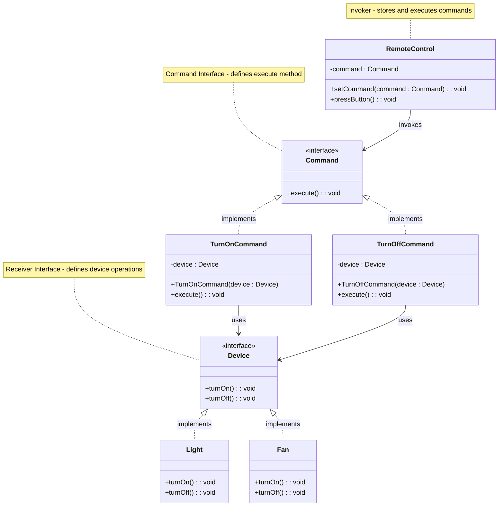

```mermaid
classDiagram
    class Command {
        <<interface>>
        +execute() : void
    }
    
    class Device {
        <<interface>>
        +turnOn() : void
        +turnOff() : void
    }
    
    class Light {
        +turnOn() : void
        +turnOff() : void
    }
    
    class Fan {
        +turnOn() : void
        +turnOff() : void
    }
    
    class TurnOnCommand {
        -device : Device
        +TurnOnCommand(device : Device)
        +execute() : void
    }
    
    class TurnOffCommand {
        -device : Device
        +TurnOffCommand(device : Device)
        +execute() : void
    }
    
    class RemoteControl {
        -command : Command
        +setCommand(command : Command) : void
        +pressButton() : void
    }
    
    Command <|.. TurnOnCommand : implements
    Command <|.. TurnOffCommand : implements
    Device <|.. Light : implements
    Device <|.. Fan : implements
    TurnOnCommand --> Device : uses
    TurnOffCommand --> Device : uses
    RemoteControl --> Command : invokes
    
    note for Command "Command Interface - defines execute method"
    note for Device "Receiver Interface - defines device operations"
    note for RemoteControl "Invoker - stores and executes commands"
```
