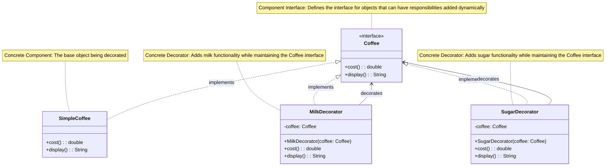

```mermaid
classDiagram
    class Coffee {
        <<interface>>
        +cost(): double
        +display(): String
    }
    
    class SimpleCoffee {
        +cost(): double
        +display(): String
    }
    
    class MilkDecorator {
        -coffee: Coffee
        +MilkDecorator(coffee: Coffee)
        +cost(): double
        +display(): String
    }
    
    class SugarDecorator {
        -coffee: Coffee
        +SugarDecorator(coffee: Coffee)
        +cost(): double
        +display(): String
    }
    
    Coffee <|.. SimpleCoffee : implements
    Coffee <|.. MilkDecorator : implements
    Coffee <|.. SugarDecorator : implements
    MilkDecorator --> Coffee : decorates
    SugarDecorator --> Coffee : decorates
    
    note for Coffee "Component Interface: Defines the interface for objects that can have responsibilities added dynamically"
    note for SimpleCoffee "Concrete Component: The base object being decorated"
    note for MilkDecorator "Concrete Decorator: Adds milk functionality while maintaining the Coffee interface"
    note for SugarDecorator "Concrete Decorator: Adds sugar functionality while maintaining the Coffee interface"
```
