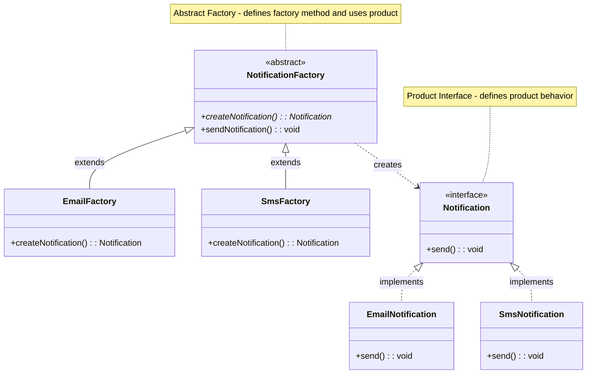

```mermaid
classDiagram
    class NotificationFactory {
        <<abstract>>
        +createNotification()* : Notification
        +sendNotification() : void
    }
    
    class EmailFactory {
        +createNotification() : Notification
    }
    
    class SmsFactory {
        +createNotification() : Notification
    }
    
    class Notification {
        <<interface>>
        +send() : void
    }
    
    class EmailNotification {
        +send() : void
    }
    
    class SmsNotification {
        +send() : void
    }
    
    NotificationFactory <|-- EmailFactory : extends
    NotificationFactory <|-- SmsFactory : extends
    Notification <|.. EmailNotification : implements
    Notification <|.. SmsNotification : implements
    NotificationFactory ..> Notification : creates
    
    note for NotificationFactory "Abstract Factory - defines factory method and uses product"
    note for Notification "Product Interface - defines product behavior"
```
