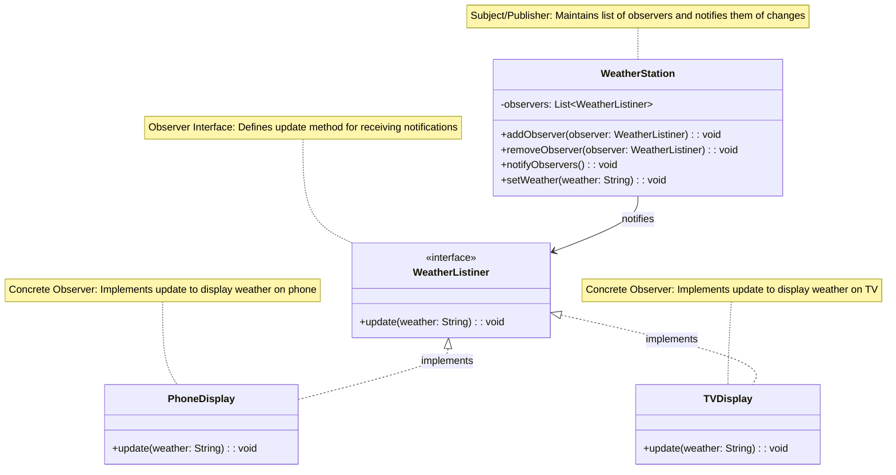

```mermaid
classDiagram
    class WeatherStation {
        -observers: List~WeatherListiner~
        +addObserver(observer: WeatherListiner): void
        +removeObserver(observer: WeatherListiner): void
        +notifyObservers(): void
        +setWeather(weather: String): void
    }
    
    class WeatherListiner {
        <<interface>>
        +update(weather: String): void
    }
    
    class PhoneDisplay {
        +update(weather: String): void
    }
    
    class TVDisplay {
        +update(weather: String): void
    }
    
    WeatherListiner <|.. PhoneDisplay : implements
    WeatherListiner <|.. TVDisplay : implements
    WeatherStation --> WeatherListiner : notifies
    
    note for WeatherStation "Subject/Publisher: Maintains list of observers and notifies them of changes"
    note for WeatherListiner "Observer Interface: Defines update method for receiving notifications"
    note for PhoneDisplay "Concrete Observer: Implements update to display weather on phone"
    note for TVDisplay "Concrete Observer: Implements update to display weather on TV"
```
