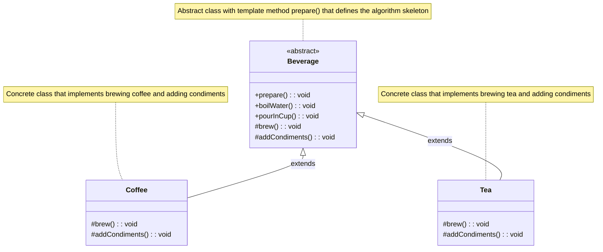

```mermaid
classDiagram
    class Beverage {
        <<abstract>>
        +prepare(): void
        +boilWater(): void
        +pourInCup(): void
        #brew(): void
        #addCondiments(): void
    }
    
    class Coffee {
        #brew(): void
        #addCondiments(): void
    }
    
    class Tea {
        #brew(): void
        #addCondiments(): void
    }
    
    Beverage <|-- Coffee : extends
    Beverage <|-- Tea : extends
    
    note for Beverage "Abstract class with template method prepare() that defines the algorithm skeleton"
    note for Coffee "Concrete class that implements brewing coffee and adding condiments"
    note for Tea "Concrete class that implements brewing tea and adding condiments"
```
